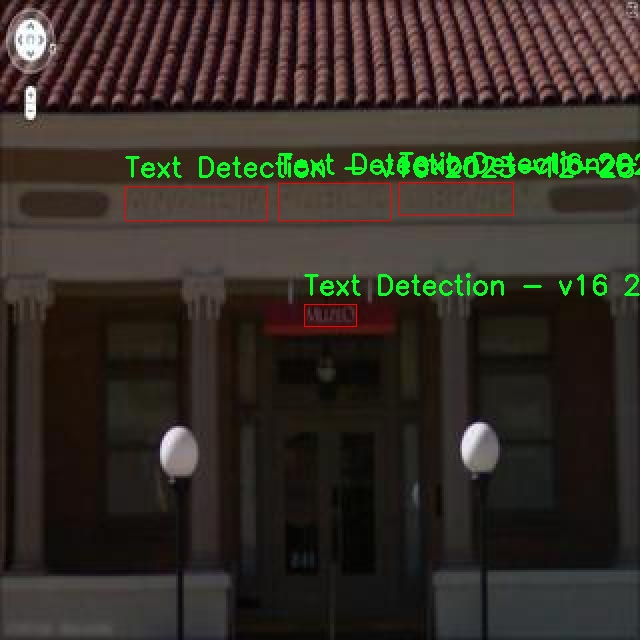

# 自然场景文本定位检测系统源码分享
 # [一条龙教学YOLOV8标注好的数据集一键训练_70+全套改进创新点发刊_Web前端展示]

### 1.研究背景与意义

项目参考[AAAI Association for the Advancement of Artificial Intelligence](https://gitee.com/qunmasj/projects)

项目来源[AACV Association for the Advancement of Computer Vision](https://kdocs.cn/l/cszuIiCKVNis)

研究背景与意义

随着信息技术的迅猛发展，文本信息的获取与处理在各个领域中变得愈发重要。自然场景文本（Natural Scene Text, NST）是指在日常生活中自然存在的文本信息，如街道标识、广告牌、商店招牌等。这些文本信息不仅承载着丰富的语义信息，还在图像理解、自动驾驶、增强现实等应用中发挥着重要作用。因此，如何高效、准确地定位和识别自然场景中的文本，成为了计算机视觉领域中的一个重要研究课题。

近年来，深度学习技术的快速发展为文本检测任务提供了新的解决方案。其中，YOLO（You Only Look Once）系列模型因其高效的实时检测能力而受到广泛关注。YOLOv8作为该系列的最新版本，进一步提升了检测精度和速度，尤其在复杂背景下的目标检测任务中表现出色。然而，尽管YOLOv8在一般物体检测中取得了显著成果，但在自然场景文本的定位与识别方面仍面临一些挑战，例如文本的多样性、复杂的背景干扰以及不同字体和颜色的变化等。

为了解决这些问题，本研究提出了一种基于改进YOLOv8的自然场景文本定位系统。该系统利用了一个包含3700张图像的文本场景数据集，涵盖了两类文本检测任务，旨在通过优化模型结构和训练策略，提高文本检测的准确性和鲁棒性。数据集的丰富性为模型的训练提供了良好的基础，使其能够在多样化的自然场景中进行有效的文本定位。

本研究的意义不仅在于推动自然场景文本检测技术的发展，还在于为相关应用提供技术支持。首先，改进的YOLOv8模型将为智能交通系统提供实时的文本信息识别能力，提升自动驾驶车辆对交通标识的理解与反应能力。其次，在增强现实应用中，准确的文本定位将使虚拟信息与现实场景的融合更加自然，为用户提供更为丰富的交互体验。此外，该研究还将为无障碍技术的发展贡献力量，通过对公共场所文本信息的自动识别，帮助视障人士更好地获取环境信息。

综上所述，基于改进YOLOv8的自然场景文本定位系统的研究，不仅具有重要的学术价值，也在实际应用中展现出广泛的前景。通过对文本检测技术的深入探索，我们期望能够推动计算机视觉领域的进一步发展，并为智能社会的构建贡献一份力量。

### 2.图片演示


##### 注意：由于此博客编辑较早，上面“2.图片演示”和“3.视频演示”展示的系统图片或者视频可能为老版本，新版本在老版本的基础上升级如下：（实际效果以升级的新版本为准）

  （1）适配了YOLOV8的“目标检测”模型和“实例分割”模型，通过加载相应的权重（.pt）文件即可自适应加载模型。

  （2）支持“图片识别”、“视频识别”、“摄像头实时识别”三种识别模式。

  （3）支持“图片识别”、“视频识别”、“摄像头实时识别”三种识别结果保存导出，解决手动导出（容易卡顿出现爆内存）存在的问题，识别完自动保存结果并导出到tempDir中。

  （4）支持Web前端系统中的标题、背景图等自定义修改，后面提供修改教程。

  另外本项目提供训练的数据集和训练教程,暂不提供权重文件（best.pt）,需要您按照教程进行训练后实现图片演示和Web前端界面演示的效果。

### 3.视频演示

[3.1 视频演示](https://www.bilibili.com/video/BV1iZxueLEh4/)

### 4.数据集信息展示

##### 4.1 本项目数据集详细数据（类别数＆类别名）

nc: 2
names: ['0', 'Text Detection - v16 2023-12-28 11-11am']


##### 4.2 本项目数据集信息介绍

数据集信息展示

在本研究中，我们使用了名为“Text scene”的数据集，旨在训练和改进YOLOv8的自然场景文本定位系统。该数据集的设计旨在为计算机视觉领域提供丰富的文本检测样本，尤其是在复杂的自然场景中。通过对该数据集的深入分析，我们能够更好地理解其结构和应用潜力，从而为模型的训练和优化提供有力支持。

“Text scene”数据集包含两个主要类别，分别是“0”和“Text Detection - v16 2023-12-28 11-11am”。这些类别的设置不仅反映了数据集的多样性，还突显了其在文本检测任务中的重要性。类别“0”代表了数据集中未标注的区域或背景，而“Text Detection - v16 2023-12-28 11-11am”则专注于自然场景中的文本元素。这种分类方式使得模型在训练过程中能够有效地区分文本与非文本区域，从而提高检测的准确性和鲁棒性。

数据集中的样本来源广泛，涵盖了多种自然场景，包括城市街道、商店招牌、广告牌、公共交通工具等。这些场景的多样性使得“Text scene”数据集在处理不同环境下的文本检测任务时，能够提供更为全面的训练数据。每个样本都经过精心标注，确保文本区域的准确定位。这种高质量的标注不仅提升了模型的学习效果，也为后续的评估和测试提供了可靠的基准。

在数据集的构建过程中，研究团队采用了先进的图像采集和标注技术，以确保数据的真实性和多样性。通过结合不同的光照条件、视角和背景，数据集中的图像能够真实地反映出自然场景中可能遇到的各种挑战。这些挑战包括但不限于文本的模糊性、遮挡、不同字体和颜色的变化等。这些因素的引入，使得“Text scene”数据集在训练YOLOv8模型时，能够有效提升其在实际应用中的适应能力。

此外，数据集的规模和丰富性也为模型的泛化能力提供了保障。通过对大量样本的学习，YOLOv8能够更好地理解文本在不同环境中的表现，从而在实际应用中实现更高的检测精度。研究人员在使用该数据集进行模型训练时，特别关注了模型在复杂场景下的表现，以确保其在真实世界中的有效性。

综上所述，“Text scene”数据集为YOLOv8的自然场景文本定位系统提供了坚实的基础。通过对该数据集的深入分析和应用，我们期待能够在文本检测领域取得显著的进展。未来的研究将继续探索如何进一步优化模型，以应对更为复杂的文本检测任务，从而推动计算机视觉技术的发展。




### 5.全套项目环境部署视频教程（零基础手把手教学）

[5.1 环境部署教程链接（零基础手把手教学）](https://www.ixigua.com/7404473917358506534?logTag=c807d0cbc21c0ef59de5)


[5.2 安装Python虚拟环境创建和依赖库安装视频教程链接（零基础手把手教学）](https://www.ixigua.com/7404474678003106304?logTag=1f1041108cd1f708b01a)

### 6.手把手YOLOV8训练视频教程（零基础小白有手就能学会）

[6.1 手把手YOLOV8训练视频教程（零基础小白有手就能学会）](https://www.ixigua.com/7404477157818401292?logTag=d31a2dfd1983c9668658)

### 7.70+种全套YOLOV8创新点代码加载调参视频教程（一键加载写好的改进模型的配置文件）

[7.1 70+种全套YOLOV8创新点代码加载调参视频教程（一键加载写好的改进模型的配置文件）](https://www.ixigua.com/7404478314661806627?logTag=29066f8288e3f4eea3a4)

### 8.70+种全套YOLOV8创新点原理讲解（非科班也可以轻松写刊发刊，V10版本正在科研待更新）

由于篇幅限制，每个创新点的具体原理讲解就不一一展开，具体见下列网址中的创新点对应子项目的技术原理博客网址【Blog】：


[8.1 70+种全套YOLOV8创新点原理讲解链接](https://gitee.com/qunmasj/good)

### 9.系统功能展示（检测对象为举例，实际内容以本项目数据集为准）

图9.1.系统支持检测结果表格显示

  图9.2.系统支持置信度和IOU阈值手动调节

  图9.3.系统支持自定义加载权重文件best.pt(需要你通过步骤5中训练获得)

  图9.4.系统支持摄像头实时识别

  图9.5.系统支持图片识别

  图9.6.系统支持视频识别

  图9.7.系统支持识别结果文件自动保存

  图9.8.系统支持Excel导出检测结果数据


### 10.原始YOLOV8算法原理

原始YOLOv8算法原理

YOLOv8是由Ultralytics公司于2023年推出的最新目标检测算法，标志着YOLO系列的又一次重要进化。该算法在设计上充分考虑了实时性与准确性的平衡，特别是在处理不同规模的目标时，展现出优越的性能。YOLOv8n作为该系列中参数量最小且速度最快的版本，成为了许多应用场景的首选。其网络结构主要由输入端、骨干网络、颈部网络和头部网络四个部分组成，每个部分在整体架构中都扮演着至关重要的角色。

在输入端，YOLOv8引入了马赛克数据增强技术，这一策略通过将多张图像拼接在一起，增强了模型对不同场景的适应能力。同时，自适应锚框计算和自适应灰度填充的应用，使得输入数据在经过预处理后能够更好地适应后续的特征提取过程。这一系列的预处理手段为模型的训练奠定了坚实的基础。

骨干网络部分，YOLOv8采用了CSP结构（Cross Stage Partial），通过将特征提取过程分为两个部分，分别进行卷积和连接，从而实现更高效的特征学习。特别是C2f模块的引入，替代了YOLOv5中的C3模块。C2f模块通过更多的分支跨层连接，增强了梯度流的丰富性，使得模型在特征表示能力上得到了显著提升。这种设计不仅提升了模型的表达能力，还有效减少了计算量。此外，SPPF（Spatial Pyramid Pooling Fusion）模块的应用，进一步提高了模型的计算速度，使得YOLOv8在处理高分辨率图像时依然能够保持良好的实时性。

颈部网络采用了路径聚合网络（PAN-FPN）结构，这一结构的设计旨在加强不同尺度对象的特征融合能力。通过多层次的特征图融合，YOLOv8能够更好地捕捉到目标的多样性，尤其是在面对复杂场景时，PAN结构的优势尤为明显。它能够有效地将低层次的细节信息与高层次的语义信息结合，从而提升检测的准确性。

在头部网络中，YOLOv8引入了解耦头结构，这一设计使得分类和检测过程得以分离，从而优化了模型的训练过程。传统的锚框检测方式在YOLOv8中被无锚框（Anchor-Free）检测方式所取代，这一创新显著减少了锚框的数量，降低了模型的复杂性，同时加速了非最大抑制（NMS）过程。这种解耦的设计理念不仅提高了检测速度，还提升了模型在不同场景下的适应能力。

损失函数的设计也是YOLOv8的一大亮点。YOLOv8采用了Task-Aligned Assigner策略来分配正负样本，结合二元交叉熵损失（BCELoss）和分布焦点损失（DFLoss）以及完全交并比损失函数（CIOULoss），形成了一个多层次的损失计算机制。这一机制使得模型在训练过程中能够更好地平衡分类与回归任务，提高了目标检测的精度。

综上所述，YOLOv8通过一系列创新的设计理念和结构优化，成功实现了在目标检测领域的重大突破。其在骨干网络、颈部网络和头部网络的改进，使得模型在保持高效性的同时，显著提升了检测精度。这些特性使得YOLOv8不仅适用于传统的目标检测任务，也为实时监控、自动驾驶等应用场景提供了强有力的技术支持。随着YOLOv8的广泛应用，未来在目标检测领域的研究与实践中，YOLOv8无疑将继续发挥重要作用，推动相关技术的不断进步与发展。


### 11.项目核心源码讲解（再也不用担心看不懂代码逻辑）

#### 11.1 70+种YOLOv8算法改进源码大全和调试加载训练教程（非必要）\ultralytics\trackers\utils\gmc.py

以下是经过精简和注释的核心代码部分，保留了主要功能和结构，同时提供了详细的中文注释。

```python
import cv2
import numpy as np
from ultralytics.utils import LOGGER

class GMC:
    """
    通用运动补偿 (GMC) 类，用于视频帧中的跟踪和物体检测。

    属性:
        method (str): 使用的跟踪方法，包括 'orb', 'sift', 'ecc', 'sparseOptFlow', 'none'。
        downscale (int): 用于处理的帧缩放因子。
        prevFrame (np.array): 存储上一帧图像。
        prevKeyPoints (list): 存储上一帧的关键点。
        prevDescriptors (np.array): 存储上一帧的描述符。
        initializedFirstFrame (bool): 标志位，指示是否已处理第一帧。
    """

    def __init__(self, method='sparseOptFlow', downscale=2):
        """初始化视频跟踪器，设置跟踪方法和缩放因子。"""
        self.method = method
        self.downscale = max(1, int(downscale))
        self.prevFrame = None
        self.prevKeyPoints = None
        self.prevDescriptors = None
        self.initializedFirstFrame = False

        # 根据选择的方法初始化检测器、提取器和匹配器
        if self.method == 'orb':
            self.detector = cv2.FastFeatureDetector_create(20)
            self.extractor = cv2.ORB_create()
            self.matcher = cv2.BFMatcher(cv2.NORM_HAMMING)
        elif self.method == 'sift':
            self.detector = cv2.SIFT_create()
            self.extractor = cv2.SIFT_create()
            self.matcher = cv2.BFMatcher(cv2.NORM_L2)
        elif self.method == 'ecc':
            self.warp_mode = cv2.MOTION_EUCLIDEAN
            self.criteria = (cv2.TERM_CRITERIA_EPS | cv2.TERM_CRITERIA_COUNT, 5000, 1e-6)
        elif self.method == 'sparseOptFlow':
            self.feature_params = dict(maxCorners=1000, qualityLevel=0.01, minDistance=1, blockSize=3)
        elif self.method in ['none', 'None', None]:
            self.method = None
        else:
            raise ValueError(f'未知的 GMC 方法: {method}')

    def apply(self, raw_frame):
        """根据指定的方法对原始帧应用物体检测。"""
        if self.method in ['orb', 'sift']:
            return self.applyFeatures(raw_frame)
        elif self.method == 'ecc':
            return self.applyEcc(raw_frame)
        elif self.method == 'sparseOptFlow':
            return self.applySparseOptFlow(raw_frame)
        else:
            return np.eye(2, 3)  # 返回单位矩阵

    def applyEcc(self, raw_frame):
        """应用ECC算法进行运动补偿。"""
        height, width, _ = raw_frame.shape
        frame = cv2.cvtColor(raw_frame, cv2.COLOR_BGR2GRAY)
        H = np.eye(2, 3, dtype=np.float32)

        # 图像下采样
        if self.downscale > 1.0:
            frame = cv2.resize(frame, (width // self.downscale, height // self.downscale))

        # 处理第一帧
        if not self.initializedFirstFrame:
            self.prevFrame = frame.copy()
            self.initializedFirstFrame = True
            return H

        # 运行ECC算法
        try:
            (cc, H) = cv2.findTransformECC(self.prevFrame, frame, H, self.warp_mode, self.criteria)
        except Exception as e:
            LOGGER.warning(f'找不到变换，使用单位矩阵: {e}')

        return H

    def applyFeatures(self, raw_frame):
        """应用特征检测算法（ORB或SIFT）。"""
        height, width, _ = raw_frame.shape
        frame = cv2.cvtColor(raw_frame, cv2.COLOR_BGR2GRAY)
        H = np.eye(2, 3)

        # 图像下采样
        if self.downscale > 1.0:
            frame = cv2.resize(frame, (width // self.downscale, height // self.downscale))

        # 检测关键点
        keypoints = self.detector.detect(frame, None)
        keypoints, descriptors = self.extractor.compute(frame, keypoints)

        # 处理第一帧
        if not self.initializedFirstFrame:
            self.prevFrame = frame.copy()
            self.prevKeyPoints = keypoints
            self.prevDescriptors = descriptors
            self.initializedFirstFrame = True
            return H

        # 匹配描述符
        knnMatches = self.matcher.knnMatch(self.prevDescriptors, descriptors, 2)
        goodMatches = [m for m, n in knnMatches if m.distance < 0.9 * n.distance]

        # 提取匹配的关键点
        prevPoints = np.array([self.prevKeyPoints[m.queryIdx].pt for m in goodMatches])
        currPoints = np.array([keypoints[m.trainIdx].pt for m in goodMatches])

        # 估计仿射变换矩阵
        if len(prevPoints) > 4:
            H, _ = cv2.estimateAffinePartial2D(prevPoints, currPoints, cv2.RANSAC)
        else:
            LOGGER.warning('匹配点不足')

        # 更新上一帧数据
        self.prevFrame = frame.copy()
        self.prevKeyPoints = keypoints
        self.prevDescriptors = descriptors

        return H

    def applySparseOptFlow(self, raw_frame):
        """应用稀疏光流法进行运动补偿。"""
        height, width, _ = raw_frame.shape
        frame = cv2.cvtColor(raw_frame, cv2.COLOR_BGR2GRAY)
        H = np.eye(2, 3)

        # 图像下采样
        if self.downscale > 1.0:
            frame = cv2.resize(frame, (width // self.downscale, height // self.downscale))

        # 检测关键点
        keypoints = cv2.goodFeaturesToTrack(frame, mask=None, maxCorners=1000, qualityLevel=0.01, minDistance=1)

        # 处理第一帧
        if not self.initializedFirstFrame:
            self.prevFrame = frame.copy()
            self.prevKeyPoints = keypoints
            self.initializedFirstFrame = True
            return H

        # 计算光流
        matchedKeypoints, status, _ = cv2.calcOpticalFlowPyrLK(self.prevFrame, frame, self.prevKeyPoints, None)

        # 提取有效的匹配点
        prevPoints = np.array([self.prevKeyPoints[i] for i in range(len(status)) if status[i]])
        currPoints = np.array([matchedKeypoints[i] for i in range(len(status)) if status[i]])

        # 估计仿射变换矩阵
        if len(prevPoints) > 4:
            H, _ = cv2.estimateAffinePartial2D(prevPoints, currPoints, cv2.RANSAC)
        else:
            LOGGER.warning('匹配点不足')

        # 更新上一帧数据
        self.prevFrame = frame.copy()
        self.prevKeyPoints = keypoints

        return H
```

### 代码说明：
1. **类 GMC**: 该类实现了通用运动补偿的功能，支持多种跟踪算法。
2. **初始化方法 `__init__`**: 根据选择的跟踪方法初始化相应的检测器、提取器和匹配器，并设置初始状态。
3. **`apply` 方法**: 根据当前选择的跟踪方法对输入帧进行处理。
4. **`applyEcc` 方法**: 实现了基于ECC算法的运动补偿。
5. **`applyFeatures` 方法**: 实现了基于特征的运动补偿，使用ORB或SIFT算法。
6. **`applySparseOptFlow` 方法**: 实现了稀疏光流法的运动补偿。

每个方法都包含了对输入帧的处理、关键点的检测和描述符的匹配，最终返回运动变换矩阵。

这个文件定义了一个名为 `GMC` 的类，主要用于视频帧中的目标跟踪和检测。它实现了多种跟踪算法，包括 ORB、SIFT、ECC 和稀疏光流，能够根据需要对帧进行下采样以提高计算效率。

在类的初始化方法 `__init__` 中，用户可以指定所用的跟踪方法和下采样因子。根据所选的方法，类会创建相应的特征检测器、描述符提取器和匹配器。例如，如果选择了 ORB 方法，则会使用 OpenCV 的 ORB 创建特征检测器和描述符提取器；如果选择了 SIFT 方法，则会使用 SIFT 相关的函数。对于 ECC 方法，类会设置一些迭代参数和终止条件；而对于稀疏光流方法，则会定义一些特征参数。

类中包含多个方法，最主要的是 `apply` 方法，它根据当前选择的跟踪方法调用相应的处理函数。具体来说，如果选择了 ORB 或 SIFT 方法，它会调用 `applyFeatures` 方法；如果选择了 ECC 方法，则调用 `applyEcc`；如果选择了稀疏光流方法，则调用 `applySparseOptFlow`。

`applyEcc` 方法实现了基于增强相关性算法的跟踪。它首先将输入帧转换为灰度图像，并根据下采样因子对图像进行处理。对于第一帧，它会初始化一些变量并返回单位矩阵。对于后续帧，它会使用 `cv2.findTransformECC` 函数计算当前帧与前一帧之间的变换矩阵。

`applyFeatures` 方法则实现了基于特征的跟踪。它同样会将输入帧转换为灰度图像，并根据下采样因子进行处理。然后，它会使用指定的特征检测器检测关键点，并计算描述符。接着，使用 BFMatcher 匹配前一帧和当前帧的描述符，并根据空间距离过滤匹配。最后，使用 RANSAC 方法估计刚性变换矩阵。

`applySparseOptFlow` 方法实现了稀疏光流跟踪。它会检测关键点并计算前一帧和当前帧之间的光流。通过 `cv2.calcOpticalFlowPyrLK` 函数找到匹配的关键点，然后同样使用 RANSAC 方法估计变换矩阵。

整个类的设计旨在提供灵活的目标跟踪功能，用户可以根据需要选择不同的跟踪算法，并且能够在处理过程中对图像进行下采样以提高效率。

#### 11.2 ui.py

```python
import sys
import subprocess

def run_script(script_path):
    """
    使用当前 Python 环境运行指定的脚本。

    Args:
        script_path (str): 要运行的脚本路径

    Returns:
        None
    """
    # 获取当前 Python 解释器的路径
    python_path = sys.executable

    # 构建运行命令
    command = f'"{python_path}" -m streamlit run "{script_path}"'

    # 执行命令
    result = subprocess.run(command, shell=True)
    if result.returncode != 0:
        print("脚本运行出错。")


# 实例化并运行应用
if __name__ == "__main__":
    # 指定您的脚本路径
    script_path = "web.py"  # 这里直接指定脚本路径

    # 运行脚本
    run_script(script_path)
```

### 代码注释

1. **导入模块**：
   - `import sys`：导入 sys 模块，用于访问与 Python 解释器紧密相关的变量和函数。
   - `import subprocess`：导入 subprocess 模块，用于执行外部命令和脚本。

2. **定义函数 `run_script`**：
   - `def run_script(script_path):`：定义一个函数，接受一个参数 `script_path`，表示要运行的脚本路径。

3. **获取 Python 解释器路径**：
   - `python_path = sys.executable`：获取当前 Python 解释器的完整路径，以便后续运行脚本时使用。

4. **构建运行命令**：
   - `command = f'"{python_path}" -m streamlit run "{script_path}"'`：构建一个命令字符串，用于调用 Streamlit 运行指定的脚本。

5. **执行命令**：
   - `result = subprocess.run(command, shell=True)`：使用 subprocess.run() 执行构建的命令。`shell=True` 允许在 shell 中执行命令。

6. **检查命令执行结果**：
   - `if result.returncode != 0:`：检查命令的返回码，如果不为 0，表示脚本运行出错。
   - `print("脚本运行出错。")`：输出错误信息。

7. **主程序入口**：
   - `if __name__ == "__main__":`：确保只有在直接运行该脚本时才会执行以下代码。
   - `script_path = "web.py"`：指定要运行的脚本路径。
   - `run_script(script_path)`：调用 `run_script` 函数，运行指定的脚本。

这个程序文件名为 `ui.py`，其主要功能是使用当前的 Python 环境来运行一个指定的脚本。程序首先导入了必要的模块，包括 `sys`、`os` 和 `subprocess`，以及一个自定义的模块 `QtFusion.path` 中的 `abs_path` 函数。

在程序中定义了一个名为 `run_script` 的函数，该函数接受一个参数 `script_path`，表示要运行的脚本的路径。函数内部首先获取当前 Python 解释器的路径，并将其存储在 `python_path` 变量中。接着，构建一个命令字符串，该命令使用 `streamlit` 模块来运行指定的脚本。具体来说，命令的格式是 `"{python_path}" -m streamlit run "{script_path}"`，其中 `python_path` 和 `script_path` 分别被替换为实际的 Python 解释器路径和脚本路径。

随后，程序使用 `subprocess.run` 方法来执行构建好的命令，并通过 `shell=True` 参数允许在 shell 中执行该命令。执行后，程序检查返回的结果码，如果不等于 0，表示脚本运行过程中出现了错误，此时会打印出一条错误信息。

在文件的最后部分，程序通过 `if __name__ == "__main__":` 语句来判断是否直接运行该脚本。如果是，程序会调用 `abs_path` 函数来获取名为 `web.py` 的脚本的绝对路径，并将其赋值给 `script_path` 变量。最后，调用 `run_script` 函数来运行这个脚本。

总体来说，这个程序的主要目的是为了方便地运行一个名为 `web.py` 的脚本，并在运行过程中处理可能出现的错误。

#### 11.3 code\ultralytics\models\__init__.py

以下是保留的核心代码部分，并附上详细的中文注释：

```python
# 导入所需的模块
from .rtdetr import RTDETR  # 导入RTDETR类
from .sam import SAM        # 导入SAM类
from .yolo import YOLO      # 导入YOLO类

# 定义可以被外部导入的模块列表
__all__ = "YOLO", "RTDETR", "SAM"  # 允许更简单的导入方式
```

### 代码注释说明：

1. **模块导入**：
   - `from .rtdetr import RTDETR`：从当前包的`rtdetr`模块中导入`RTDETR`类。
   - `from .sam import SAM`：从当前包的`sam`模块中导入`SAM`类。
   - `from .yolo import YOLO`：从当前包的`yolo`模块中导入`YOLO`类。

2. **`__all__`变量**：
   - `__all__`是一个特殊变量，用于定义当使用`from module import *`语句时，哪些名称是可以被导入的。在这里，它指定了`YOLO`、`RTDETR`和`SAM`这三个类可以被外部模块访问，从而实现更简洁的导入方式。

这个程序文件是一个Python模块的初始化文件，文件名为`__init__.py`，它位于`code/ultralytics/models/`目录下。该文件的主要作用是定义模块的公共接口和导入其他子模块。

首先，文件开头的注释部分提到这是与Ultralytics YOLO相关的代码，并且遵循AGPL-3.0许可证。这表明该代码是开源的，用户在使用时需要遵循相应的许可证条款。

接下来，文件通过`from .rtdetr import RTDETR`、`from .sam import SAM`和`from .yolo import YOLO`三行代码导入了三个不同的类或模块：`RTDETR`、`SAM`和`YOLO`。这些类或模块可能是实现不同功能的深度学习模型，具体来说，YOLO（You Only Look Once）是一种常用的目标检测算法，而RTDETR和SAM可能是其他相关的模型或工具。

最后，`__all__`变量被定义为一个元组，包含了三个字符串：`"YOLO"`、`"RTDETR"`和`"SAM"`。这个变量的作用是控制从该模块中使用`from module import *`语句时，哪些名称会被导入。通过定义`__all__`，模块的使用者可以更方便地导入这些主要的类或函数，而不必关心模块内部的实现细节。

总体而言，这个文件是Ultralytics YOLO模型库的一部分，负责组织和导出相关的模型类，使得用户能够方便地使用这些模型进行目标检测等任务。

#### 11.4 code\ultralytics\data\utils.py

以下是经过简化和注释的核心代码部分，主要集中在数据集处理和验证功能上：

```python
import os
import hashlib
from pathlib import Path
from PIL import Image, ImageOps
import numpy as np

IMG_FORMATS = ("bmp", "jpeg", "jpg", "png", "tif", "tiff")  # 支持的图像格式

def img2label_paths(img_paths):
    """根据图像路径生成对应的标签路径"""
    # 将图像路径中的 'images' 替换为 'labels'，并将后缀改为 '.txt'
    return [x.replace('/images/', '/labels/').rsplit(".", 1)[0] + ".txt" for x in img_paths]

def get_hash(paths):
    """计算给定路径列表的哈希值"""
    size = sum(os.path.getsize(p) for p in paths if os.path.exists(p))  # 计算文件大小总和
    h = hashlib.sha256(str(size).encode())  # 计算大小的哈希值
    h.update("".join(paths).encode())  # 将路径连接并更新哈希
    return h.hexdigest()  # 返回哈希值

def exif_size(img: Image.Image):
    """返回经过EXIF校正的图像尺寸"""
    s = img.size  # 获取图像尺寸 (宽, 高)
    if img.format == "JPEG":  # 仅支持JPEG格式
        exif = img.getexif()  # 获取EXIF信息
        if exif:
            rotation = exif.get(274, None)  # 获取旋转信息
            if rotation in [6, 8]:  # 如果旋转为270或90度
                s = s[1], s[0]  # 交换宽高
    return s

def verify_image(im_file):
    """验证单张图像的有效性"""
    nf, nc, msg = 0, 0, ""  # 统计有效和无效图像的数量
    try:
        im = Image.open(im_file)  # 打开图像
        im.verify()  # 验证图像
        shape = exif_size(im)  # 获取图像尺寸
        assert (shape[0] > 9) and (shape[1] > 9), f"图像尺寸 {shape} 小于10像素"  # 确保尺寸有效
        assert im.format.lower() in IMG_FORMATS, f"无效的图像格式 {im.format}"  # 确保格式有效
        nf = 1  # 图像有效
    except Exception as e:
        nc = 1  # 图像无效
        msg = f"警告 ⚠️ {im_file}: 忽略损坏的图像: {e}"  # 记录错误信息
    return im_file, nf, nc, msg  # 返回图像文件名及其状态

def verify_image_label(im_file, lb_file):
    """验证图像及其对应标签的有效性"""
    nf, nc, msg = 0, 0, ""  # 统计有效和无效标签的数量
    try:
        # 验证图像
        im = Image.open(im_file)
        im.verify()
        shape = exif_size(im)
        assert (shape[0] > 9) and (shape[1] > 9), f"图像尺寸 {shape} 小于10像素"
        assert im.format.lower() in IMG_FORMATS, f"无效的图像格式 {im.format}"
        nf = 1  # 图像有效

        # 验证标签
        if os.path.isfile(lb_file):
            nf = 1  # 标签存在
            with open(lb_file) as f:
                lb = [x.split() for x in f.read().strip().splitlines() if len(x)]  # 读取标签
                lb = np.array(lb, dtype=np.float32)  # 转换为numpy数组
            nl = len(lb)  # 标签数量
            if nl == 0:
                msg = f"警告 ⚠️ {im_file}: 标签为空"  # 标签为空的警告
        else:
            msg = f"警告 ⚠️ {im_file}: 标签缺失"  # 标签缺失的警告
    except Exception as e:
        nc = 1  # 标签无效
        msg = f"警告 ⚠️ {im_file}: 忽略损坏的图像/标签: {e}"  # 记录错误信息
    return im_file, nf, msg  # 返回图像文件名及其状态

# 示例：验证图像和标签
img_file = "path/to/image.jpg"
label_file = img2label_paths([img_file])[0]  # 获取对应标签路径
result = verify_image_label(img_file, label_file)  # 验证图像和标签
print(result)  # 输出结果
```

### 代码注释说明
1. **img2label_paths**: 该函数接收图像路径列表，并返回对应的标签路径列表。通过替换路径中的“images”为“labels”并更改文件后缀为“.txt”来实现。
2. **get_hash**: 计算给定路径列表的哈希值，确保文件的唯一性和完整性。
3. **exif_size**: 处理JPEG图像的EXIF信息，返回经过校正的图像尺寸，考虑到图像的旋转信息。
4. **verify_image**: 验证单张图像的有效性，包括检查图像格式和尺寸，返回有效性统计信息。
5. **verify_image_label**: 验证图像及其对应标签的有效性，确保标签文件存在且格式正确，返回验证结果。

以上代码是对原始代码的核心部分进行了提炼和注释，便于理解其功能和逻辑。

这个程序文件是一个用于处理数据集的工具类，主要与图像和标签的验证、数据集的下载和管理等功能相关。它是Ultralytics YOLO项目的一部分，主要用于目标检测、分割和分类任务。文件中包含多个函数和类，每个函数和类都有其特定的功能。

首先，文件导入了一些必要的库，包括文件和路径处理、图像处理、哈希计算、JSON处理等。它定义了一些常量，比如支持的图像和视频格式，以及一个全局的内存固定标志。

接下来，定义了一些函数：

- `img2label_paths(img_paths)`：根据图像路径生成对应的标签路径。
- `get_hash(paths)`：计算给定文件或目录路径的哈希值，用于验证文件的完整性。
- `exif_size(img)`：返回经过EXIF校正的图像大小，主要用于JPEG格式的图像。
- `verify_image(args)`：验证单个图像的有效性，包括检查图像格式、大小等，并尝试修复损坏的JPEG图像。
- `verify_image_label(args)`：验证图像和标签的配对，确保标签文件存在且格式正确。
- `polygon2mask(imgsz, polygons, color, downsample_ratio)`：将多边形转换为二进制掩码，适用于图像分割任务。
- `polygons2masks(imgsz, polygons, color, downsample_ratio)`：将多个多边形转换为多个二进制掩码。
- `find_dataset_yaml(path)`：在指定路径中查找数据集的YAML文件，确保数据集的格式正确。
- `check_det_dataset(dataset, autodownload=True)`：检查目标检测数据集的可用性，如果未找到，则可以选择自动下载并解压数据集。
- `check_cls_dataset(dataset, split="")`：检查分类数据集的可用性，并尝试下载缺失的数据集。
- `HUBDatasetStats`类：用于生成HUB数据集的统计信息和JSON文件，支持数据集的压缩和处理。
- `compress_one_image(f, f_new=None, max_dim=1920, quality=50)`：压缩单个图像文件，保持其纵横比和质量。
- `autosplit(path, weights=(0.9, 0.1, 0.0), annotated_only=False)`：自动将数据集拆分为训练、验证和测试集，并保存结果到文本文件中。

整体来看，这个文件提供了一系列功能强大的工具，帮助用户管理和处理数据集，确保数据集的质量和格式符合YOLO模型的要求。通过这些工具，用户可以方便地进行数据集的验证、下载、压缩和拆分等操作，为后续的模型训练和评估做好准备。

#### 11.5 code\ultralytics\data\annotator.py

以下是经过简化和注释的核心代码部分：

```python
from pathlib import Path
from ultralytics import SAM, YOLO

def auto_annotate(data, det_model="yolov8x.pt", sam_model="sam_b.pt", device="", output_dir=None):
    """
    自动标注图像，使用YOLO目标检测模型和SAM分割模型。

    参数:
        data (str): 包含待标注图像的文件夹路径。
        det_model (str, optional): 预训练的YOLO检测模型，默认为'yolov8x.pt'。
        sam_model (str, optional): 预训练的SAM分割模型，默认为'sam_b.pt'。
        device (str, optional): 模型运行的设备，默认为空字符串（使用CPU或可用的GPU）。
        output_dir (str | None | optional): 保存标注结果的目录，默认为与'data'相同目录下的'labels'文件夹。

    示例:
        auto_annotate(data='ultralytics/assets', det_model='yolov8n.pt', sam_model='mobile_sam.pt')
    """
    # 加载YOLO检测模型
    det_model = YOLO(det_model)
    # 加载SAM分割模型
    sam_model = SAM(sam_model)

    # 将数据路径转换为Path对象
    data = Path(data)
    # 如果未指定输出目录，则创建一个默认输出目录
    if not output_dir:
        output_dir = data.parent / f"{data.stem}_auto_annotate_labels"
    # 创建输出目录（如果不存在）
    Path(output_dir).mkdir(exist_ok=True, parents=True)

    # 使用YOLO模型进行目标检测，返回检测结果
    det_results = det_model(data, stream=True, device=device)

    # 遍历每个检测结果
    for result in det_results:
        # 获取检测到的类别ID
        class_ids = result.boxes.cls.int().tolist()
        # 如果检测到的类别ID不为空
        if len(class_ids):
            # 获取边界框坐标
            boxes = result.boxes.xyxy
            # 使用SAM模型进行分割，传入边界框
            sam_results = sam_model(result.orig_img, bboxes=boxes, verbose=False, save=False, device=device)
            # 获取分割结果
            segments = sam_results[0].masks.xyn

            # 将分割结果写入文本文件
            with open(f"{Path(output_dir) / Path(result.path).stem}.txt", "w") as f:
                for i in range(len(segments)):
                    s = segments[i]
                    # 如果分割结果为空，则跳过
                    if len(s) == 0:
                        continue
                    # 将分割结果转换为字符串并写入文件
                    segment = map(str, segments[i].reshape(-1).tolist())
                    f.write(f"{class_ids[i]} " + " ".join(segment) + "\n")
```

### 代码说明：
1. **导入必要的库**：使用`pathlib`处理文件路径，使用`ultralytics`库中的`SAM`和`YOLO`模型。
2. **定义`auto_annotate`函数**：该函数接受图像数据路径、模型文件、设备和输出目录等参数。
3. **加载模型**：根据传入的模型文件名加载YOLO和SAM模型。
4. **创建输出目录**：如果未指定输出目录，则自动创建一个基于输入数据路径的输出目录。
5. **目标检测**：使用YOLO模型对输入数据进行目标检测，获取检测结果。
6. **处理检测结果**：遍历每个检测结果，提取类别ID和边界框，使用SAM模型进行图像分割。
7. **保存分割结果**：将分割结果写入文本文件，文件名与输入图像相同。每行包含类别ID和对应的分割坐标。

这个程序文件是用于自动标注图像的，主要依赖于YOLO（You Only Look Once）目标检测模型和SAM（Segment Anything Model）分割模型。其核心功能是读取指定文件夹中的图像，利用预训练的YOLO模型进行目标检测，然后通过SAM模型对检测到的目标进行分割，最终将结果保存为文本文件。

程序首先导入了必要的库，包括`Path`用于处理文件路径，以及`SAM`和`YOLO`类，这些类是来自于`ultralytics`库的模型实现。接着定义了一个名为`auto_annotate`的函数，该函数接受多个参数，包括数据路径、目标检测模型、分割模型、设备类型和输出目录。

在函数内部，首先加载指定的YOLO和SAM模型。如果没有提供输出目录，程序会自动在数据路径的同级目录下创建一个名为“_auto_annotate_labels”的文件夹，以存储标注结果。接着，使用YOLO模型对指定路径下的图像进行目标检测，结果以流的形式返回。

对于每个检测结果，程序提取出检测到的类别ID和边界框信息。如果检测到的类别ID不为空，程序会将边界框传递给SAM模型进行分割处理。分割结果以掩码的形式返回，程序会将每个分割的结果转换为文本格式，并将其写入到对应的文本文件中。每个文本文件的命名与原始图像文件名相同，文件内容包括类别ID和分割坐标。

总的来说，这段代码实现了从图像中自动检测和分割目标的功能，适用于需要快速生成标注数据的场景。通过使用YOLO和SAM模型的组合，用户可以高效地处理大量图像数据，节省手动标注的时间和精力。

#### 11.6 code\ultralytics\models\yolo\classify\predict.py

以下是代码中最核心的部分，并附上详细的中文注释：

```python
import cv2
import torch
from PIL import Image
from ultralytics.engine.predictor import BasePredictor
from ultralytics.engine.results import Results
from ultralytics.utils import ops

class ClassificationPredictor(BasePredictor):
    """
    扩展自 BasePredictor 类的分类预测器类。
    该类用于基于分类模型进行预测。
    """

    def __init__(self, cfg=DEFAULT_CFG, overrides=None, _callbacks=None):
        """初始化 ClassificationPredictor，将任务设置为 'classify'。"""
        super().__init__(cfg, overrides, _callbacks)  # 调用父类构造函数
        self.args.task = "classify"  # 设置任务类型为分类
        self._legacy_transform_name = "ultralytics.yolo.data.augment.ToTensor"  # 旧版转换名称

    def preprocess(self, img):
        """将输入图像转换为模型兼容的数据类型。"""
        if not isinstance(img, torch.Tensor):  # 如果输入不是张量
            is_legacy_transform = any(
                self._legacy_transform_name in str(transform) for transform in self.transforms.transforms
            )
            if is_legacy_transform:  # 处理旧版转换
                img = torch.stack([self.transforms(im) for im in img], dim=0)  # 堆叠转换后的图像
            else:
                img = torch.stack(
                    [self.transforms(Image.fromarray(cv2.cvtColor(im, cv2.COLOR_BGR2RGB))) for im in img], dim=0
                )  # 将BGR图像转换为RGB并进行转换
        img = (img if isinstance(img, torch.Tensor) else torch.from_numpy(img)).to(self.model.device)  # 转换为张量并移动到模型设备
        return img.half() if self.model.fp16 else img.float()  # 将uint8转换为fp16或fp32

    def postprocess(self, preds, img, orig_imgs):
        """对预测结果进行后处理，返回 Results 对象。"""
        if not isinstance(orig_imgs, list):  # 如果原始图像不是列表
            orig_imgs = ops.convert_torch2numpy_batch(orig_imgs)  # 转换为numpy数组

        results = []
        for i, pred in enumerate(preds):  # 遍历每个预测结果
            orig_img = orig_imgs[i]  # 获取对应的原始图像
            img_path = self.batch[0][i]  # 获取图像路径
            results.append(Results(orig_img, path=img_path, names=self.model.names, probs=pred))  # 创建结果对象并添加到结果列表
        return results  # 返回结果列表
```

### 代码核心部分说明：
1. **导入必要的库**：引入了 OpenCV、PyTorch 和 PIL 等库，用于图像处理和深度学习模型的操作。
2. **ClassificationPredictor 类**：继承自 `BasePredictor`，用于实现分类任务的预测。
3. **初始化方法**：设置任务类型为分类，并处理旧版转换的名称。
4. **预处理方法**：将输入图像转换为适合模型的格式，包括处理旧版转换和设备移动。
5. **后处理方法**：将模型的预测结果转换为 `Results` 对象，便于后续使用和分析。

这个程序文件是Ultralytics YOLO（You Only Look Once）框架中的一个分类预测模块，文件名为`predict.py`。它主要实现了基于分类模型的图像预测功能。以下是对代码的详细说明。

首先，文件导入了一些必要的库，包括`cv2`（用于图像处理）、`torch`（用于深度学习模型的操作）和`PIL`（用于图像处理）。接着，它从Ultralytics框架中导入了`BasePredictor`、`Results`以及一些工具函数。

接下来，定义了一个名为`ClassificationPredictor`的类，它继承自`BasePredictor`类。这个类专门用于基于分类模型进行预测。类的文档字符串中提到，用户可以将Torchvision的分类模型传递给`model`参数，例如`model='resnet18'`。

在类的构造函数`__init__`中，调用了父类的构造函数，并将任务类型设置为“classify”，表示该类用于分类任务。同时，定义了一个名为`_legacy_transform_name`的属性，用于处理旧版的图像转换。

`preprocess`方法用于对输入图像进行预处理，以便将其转换为模型可以接受的数据类型。该方法首先检查输入图像是否为`torch.Tensor`类型。如果不是，它会根据是否使用了旧版转换来处理图像。如果使用了旧版转换，图像将通过`self.transforms`进行处理；否则，图像将先通过OpenCV转换为RGB格式，然后再进行处理。处理完成后，图像将被转换为适合模型的设备格式，并根据模型的设置将数据类型转换为半精度（fp16）或单精度（fp32）。

`postprocess`方法用于对模型的预测结果进行后处理，以返回`Results`对象。该方法首先检查原始图像是否为列表，如果不是，则将其转换为NumPy数组。然后，对于每个预测结果，方法会将原始图像、图像路径、模型名称和预测概率打包成一个`Results`对象，并将其添加到结果列表中，最终返回该列表。

总体而言，这个文件实现了图像分类的预测流程，包括图像的预处理和后处理，适用于使用YOLO模型进行分类任务的场景。

### 12.系统整体结构（节选）

### 整体功能和构架概括

Ultralytics YOLO项目是一个基于YOLO（You Only Look Once）目标检测算法的深度学习框架，旨在提供高效的目标检测、分类和分割功能。该项目包含多个模块和工具，涵盖了从数据处理、模型训练到预测的完整流程。整体架构包括以下几个主要部分：

1. **数据处理**：提供数据集的加载、验证和预处理功能，确保输入数据的质量和格式符合模型要求。
2. **模型定义**：实现了YOLO及其变种模型的定义和初始化，支持多种模型架构。
3. **训练与评估**：提供模型训练和评估的功能，包括损失计算、优化器设置等。
4. **预测**：实现图像和视频的目标检测、分类和分割功能，支持多种输入格式和输出结果的处理。
5. **工具和实用程序**：提供各种辅助工具，如图像标注、模型导入导出、结果可视化等。

### 文件功能整理表

| 文件路径                                                                 | 功能描述                                                   |
|------------------------------------------------------------------------|----------------------------------------------------------|
| `ultralytics/trackers/utils/gmc.py`                                   | 实现多种目标跟踪算法，包括ORB、SIFT、ECC和稀疏光流。               |
| `ui.py`                                                                | 运行指定的Python脚本，主要用于启动与用户界面相关的功能。               |
| `code/ultralytics/models/__init__.py`                                 | 定义模块的公共接口，导入YOLO、RTDETR和SAM模型。                  |
| `code/ultralytics/data/utils.py`                                      | 提供数据集验证、下载、处理等工具函数，确保数据集的质量和格式。        |
| `code/ultralytics/data/annotator.py`                                  | 自动标注图像，利用YOLO和SAM模型进行目标检测和分割。               |
| `code/ultralytics/models/yolo/classify/predict.py`                   | 实现图像分类模型的预测功能，包括图像的预处理和后处理。             |
| `code/ultralytics/models/yolo/classify/train.py`                     | 实现YOLO分类模型的训练功能，包括损失计算和优化器设置。            |
| `code/ultralytics/nn/autobackend.py`                                  | 提供自动选择后端框架的功能，支持多种深度学习框架的兼容性。           |
| `ultralytics/models/yolo/detect/predict.py`                           | 实现YOLO目标检测模型的预测功能，处理图像和视频输入。               |
| `code/ultralytics/engine/predictor.py`                                | 提供统一的预测接口，封装不同模型的预测逻辑。                        |
| `code/ultralytics/models/sam/build.py`                                 | 实现SAM（Segment Anything Model）模型的构建和初始化。             |
| `train.py`                                                             | 主训练脚本，负责模型的训练和评估过程。                           |
| `code/ultralytics/models/yolo/detect/__init__.py`                    | 定义YOLO检测模块的公共接口，导入相关功能。                        |

这个表格总结了各个文件的主要功能，帮助用户快速了解Ultralytics YOLO项目的结构和功能模块。

注意：由于此博客编辑较早，上面“11.项目核心源码讲解（再也不用担心看不懂代码逻辑）”中部分代码可能会优化升级，仅供参考学习，完整“训练源码”、“Web前端界面”和“70+种创新点源码”以“13.完整训练+Web前端界面+70+种创新点源码、数据集获取”的内容为准。

### 13.完整训练+Web前端界面+70+种创新点源码、数据集获取


# [下载链接：https://mbd.pub/o/bread/ZpuZmJhy](https://mbd.pub/o/bread/ZpuZmJhy)